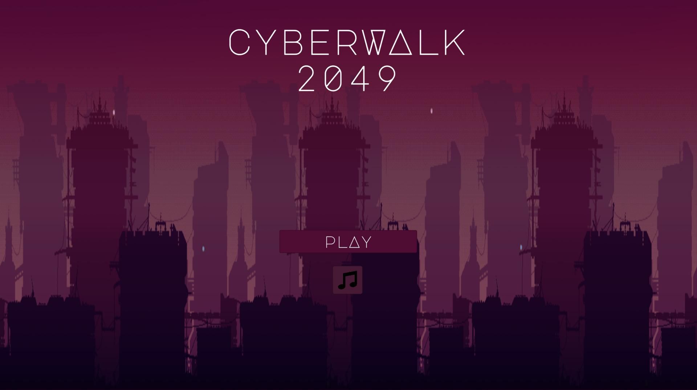
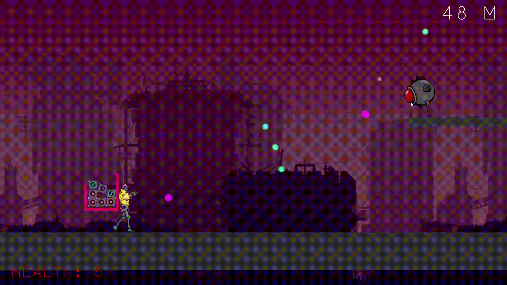
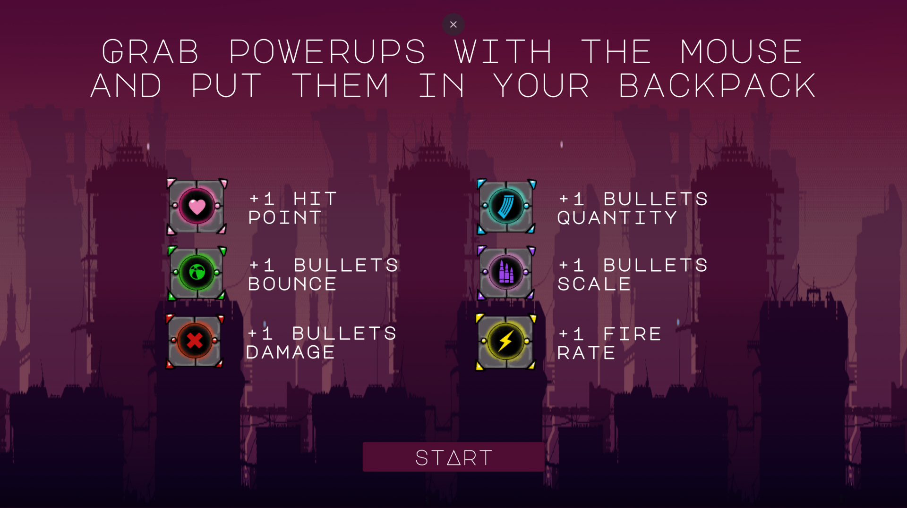
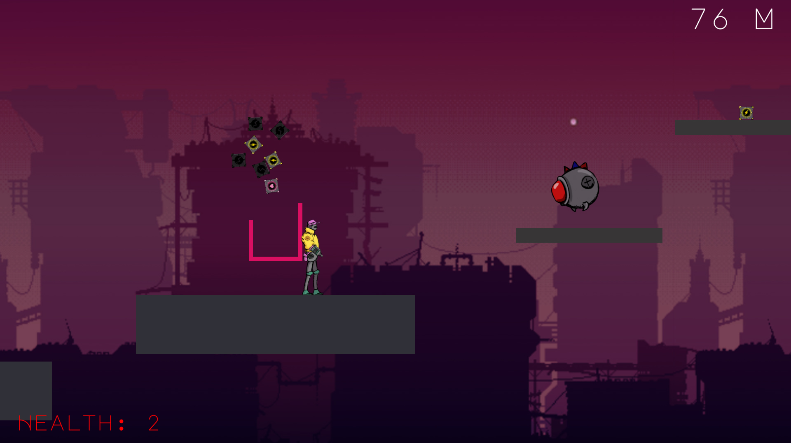

# Cyberwalk

**Play it [here](https://nachodlv.itch.io/cyberwalk-2049)**

2D infinite runner where you need to grab powerups along the way and pu them inside your backpack. If any of those powerups falloff from it then you will lose that upgrade. The objective of the game is to walk as far as possible while avoiding the enemies.

This games was made for the game jam Ludum Dare 49 in a three days span.

The team was compose of two programmers, one artist and one game designer.

## Screenshots

